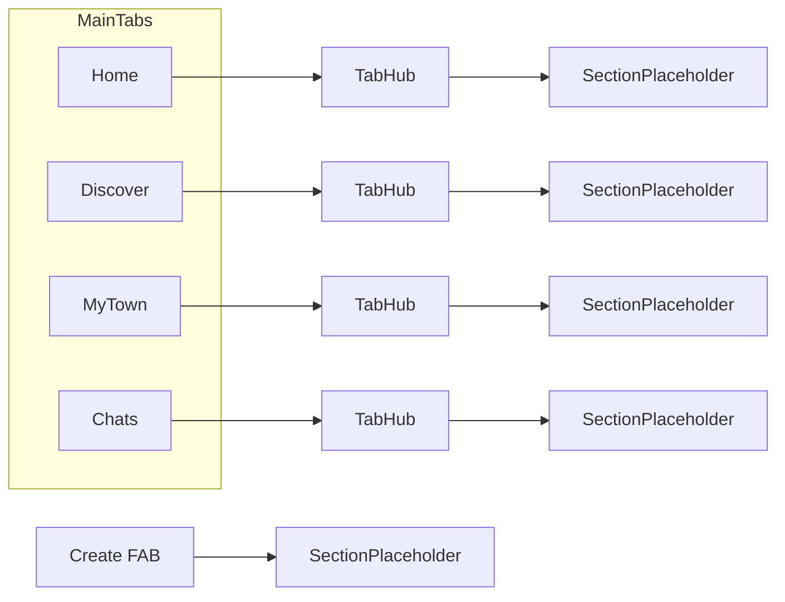

# Commu app navigation (prototype)

Authoritative structure for the domain navigation prototype. Section `id` values match [`src/navigation/appStructure.ts`](../src/navigation/appStructure.ts).

## Primary tabs (bottom navigation)

| id        | Label    |
| --------- | -------- |
| `home`    | Home       |
| `chats`   | Chats    |
| `discover` | Discover |
| `myTown`  | My town  |

## Sections by tab

### Home (`home`)

| id                  | Label                                      |
| ------------------- | ------------------------------------------ |
| `home.newest-nearby` | Nearby                                 |
| ↳ `home.map-nearby`  | Map (nearby)  *(child of Nearby; badge: Great for first-time)* |
| `home.newest-remote` | Remote                                 |
| `home.favorites`    | Favorites                                  |

### Discover (`discover`)

| id                         | Label                         | Notes        |
| -------------------------- | ----------------------------- | ------------ |
| `discover.posts`           | Posts                         |              |
| ↳ `discover.nearby`          | Nearby                     | *(child of Posts; map + carousel)* |
| ↳ `discover.search-posts`    | Search for posts           | *(child of Posts)* |
| ↳ `discover.found-for-you`   | Found for you              | *(child of Posts)* |
| ↳ `discover.popular-country` | Popular in Finland    | *(child of Posts)* |
| `discover.stories`         | Stories                       |              |
| ↳ `discover.search-stories`  | Search for stories         | *(child of Stories)* |
| ↳ `discover.news-commu`      | News from Commu            | *(child of Stories)* |
| `discover.my-community`    | Community             |              |
| `discover.commu-news`      | News                  |              |

### My town (`myTown`)

| id | Label |
| -- | ----- |
| `my-town.citizen-forums` | Citizen forums |
| `my-town.citizen-benefits` | Citizen benefits |
| `my-town.municipality-news` | News from municipality |
| `my-town.pings` | Pings |
| ↳ `my-town.org-messages` | Internal messages for organization members *(child of Pings)* |
| ↳ `my-town.resident-polls` | Resident polls *(child of Pings)* |

### Chats (`chats`)

No hub rows: the tab itself is “Chats,” so the main conversation UI lives here without a duplicate list item.

## Floating action (create)

| id            | Label        |
| ------------- | ------------ |
| `create.post` | Create post  |
| `create.story` | Create story |

## Header chrome

- **Left:** Avatar opens the **User** menu (below).
- **Right:** Bell opens the **Notifications** sheet (below) — not inside the avatar menu.

## Avatar menu (User)

`id` is stable for future routing.

- `avatar.profile` — Profile
- `avatar.my-posts` — My posts
- `avatar.tasks` — Tasks
- `avatar.settings` — Settings
  - `avatar.language` — Language *(nested under Settings)*
- `avatar.help` — Help

## Notifications panel

Opened from the **top-right** bell; same `id`s as in code (`notificationMenuEntries`).

- `avatar.new-help-posts` — New help posts
- `avatar.new-chat-messages` — New chat messages
- `avatar.new-help-near-you` — New help posts near you
- `avatar.likes-comments-own` — Likes/comments to your own help posts or stories
- `avatar.done-deeds` — Confirmation on done deeds
- `avatar.unconfirmed-tasks` — Unconfirmed tasks
- `avatar.unconfirmed-help-records` — Unconfirmed help records
- `avatar.onboarding-tasks` — Onboarding tasks
- `avatar.done-deed-confirmed` — Done deed confirmed

## Flow diagram

## Prototype behavior

- Each tab shows a **hub** list of sections; a tap opens a **placeholder** screen for that `id`.
- **Home** feed content is parked; hubs and placeholders only.
- **FAB** opens create actions that lead to `create.post` / `create.story` placeholders.
- **Avatar** opens a scrollable menu of the items above (stub navigation).
